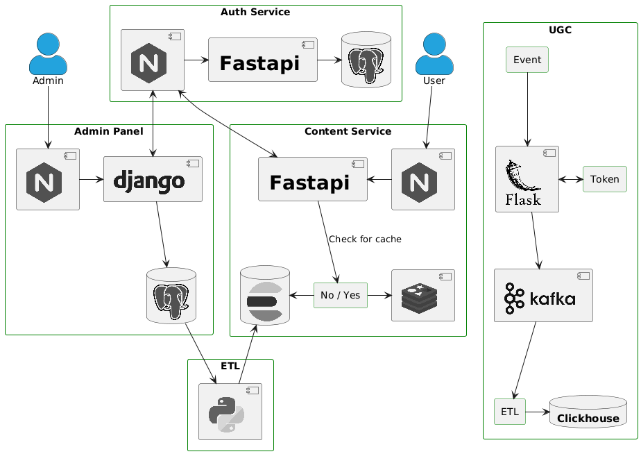

# Service UGC (User-generated content)

### Description

A service for collecting user actions on various interface elements, such as movies, trailers, categories, and other key elements of the site. Collecting data into your system will allow you, for example, to attach sensitive user information to them and do a more comprehensive analysis. This service will collect user behavior on the site, which will help optimize the user experience and improve the quality of service.

Project content:
- CI/CD with GitHub Actions
- Services Architecture
- Flask API for collecting user generated content
- ETL to transfer data to the analytical storage (Kafka to Clickhouse)
- ELK (Elasticsearch, Logstash, and Kibana) for managing data logging.  
<br>

API features:
- Create Kafka topics
- Send messages to Kafka
- Store information about bookmarks, likes and reviews to MongoDB

<br>

### Two steps are needed to launch the project:

- *Change the file `.env.sample` to `.env` and set the environment variables* 

- *Run the `docker-compose.yml` file*

<br>

*All environment variables samples are included in the `.env.sample` files.*

*Don't forget to set the environment variables before running the project!*


<br>

### Technologies used:


###### Python, Flask, Nginx, MongoDB, Kafka, Clickhouse, Zookeeper, Elasticsearch, Kibana, Logstash, Filebeat, Sentry, Docker

<br><br>

### Services Architecture

<br>




<br>


###### (*) *Do not use this project for a real deployment*.

<br>

# Run the project

### 1. Set the environment variables 
```
Change all .env.sample files to .env and set the environment variables in the next locations:

- service_ugc/etl/.env
- service_ugc/flask_app/src/.env
- service_ugc/.env
```

### 2. Run docker-compose.yml

```
$ cd service_ugc/

$ sudo docker compose up --build -d
```

### 3. Run ETL (Kafka to Clickhouse)
#####  *После успешного запуска сервисов Kafka и Clickhouse*

```Bash
docker start ugc_etl
```

<br>

### Optional
####  API Tests

```Bash
docker exec -it ugc sh -c "python3 -m pytest"
```

<br><br><br>


# Data management

<br>


## 1. Example of Kafka message  

| KEY              | VALUE               
| ----------       |--------------------------
| user_123         | CLICK - event description - created - start time - end time               

<br>


## 2. Example of data stored in Clickhouse  

| user_id     | action      | description         | event_time          | start_time    | end_time     
|-------------|-------------|---------------------|---------------------|---------------|---------------
| user_123    | CLICK       | event description   | 01/02/2024 08:40:00 | 08:46:00      | 09:47:00 
| user_456    | VIEW        | event description   | 03/02/2024 12:00:00 | 16:34:36      | 16:52:27 
| user_123    | VIEW        | event description   | 05/02/2024 06:30:00 | 06:35:00      | 09:47:00   

<br>


## 3. Example of data stored in  MongoDB  

### Likes 

| user_id          | film_id                                    | like
| ----------       |-------------------------------------       |----------
| user_123         | d9fb3d50-7415-4779-b780-824659acf34e       | true  


### Bookmarks

| user_id          | url                                  
| ----------       |-------------------------------------------
| user_123         |https://github.com/mijail-naal/ugc_sprint_1
| user_123         |https://github.com/mijail-naal/ugc_sprint_2


### Reviews

| user_id     | film_id                              | created_at          | user_review         |
|-------------|--------------------------------------|---------------------|---------------------|
| user_123    | 410c62e1-5bab-4194-a042-304af966d228 | 01/02/2024 08:40:00 | Review from user    |

